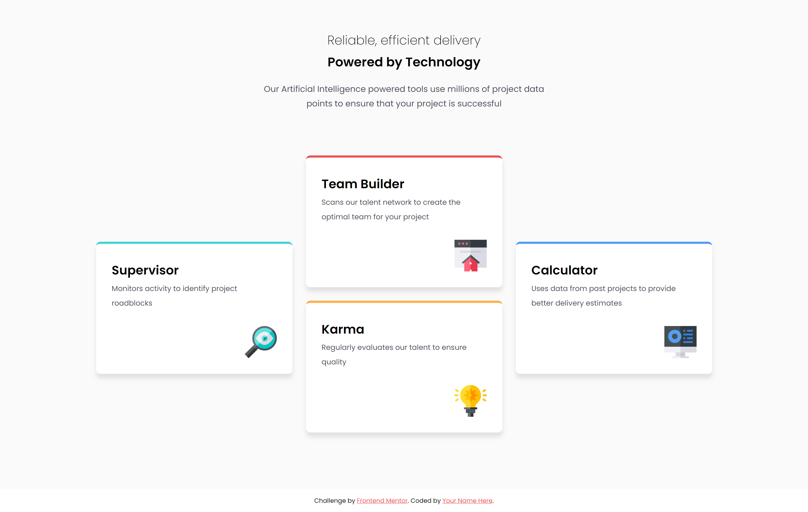
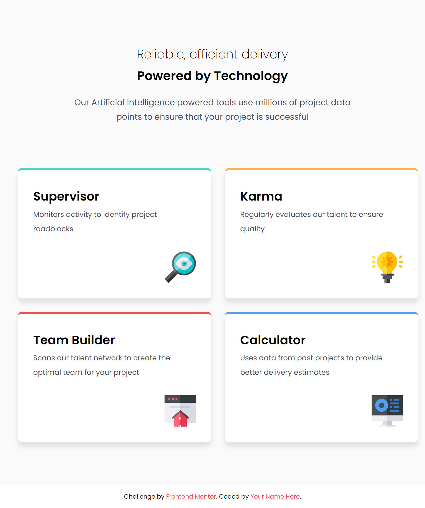
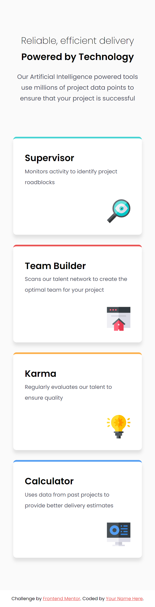

# Frontend Mentor - Four card feature section solution

This is a solution to the [Four card feature section challenge on Frontend Mentor](https://www.frontendmentor.io/challenges/four-card-feature-section-weK1eFYK). Frontend Mentor challenges help you improve your coding skills by building realistic projects. 

## Table of contents

- [Overview](#overview)
  - [The challenge](#the-challenge)
  - [Screenshot](#screenshot)
- [My process](#my-process)
  - [Built with](#built-with)
  - [What I learned](#what-i-learned)
 - [Useful resources](#useful-resources)
- [Author](#author)

## Overview

### The challenge

Users should be able to:

- View the optimal layout for the site depending on their device's screen size

### Screenshot





## My process

### Built with

- Flexbox
- HTML and SCSS
- Mobile-first workflow
- Webstorm with pre-built server and File Watcher with SCSS for building CSS


**Note: These are just examples. Delete this note and replace the list above with your own choices**

### What I learned

Use this section to recap over some of your major learnings while working through this project. Writing these out and providing code samples of areas you want to highlight is a great way to reinforce your own knowledge.

To see how you can add code snippets, see below:

- make design responsive to changes in screen size
```css
&__grid {
  display: flex;
  flex-direction: column;
  flex-wrap: wrap;
  gap: 1.5rem;
}
```

### Useful resources

- [An Interactive Guide to Flexbox](https://www.joshwcomeau.com/css/interactive-guide-to-flexbox/) 
- [Flexbox Froggy](https://flexboxfroggy.com/#de) 
- [Grid Garden](https://cssgridgarden.com/#de) 

## Author


- Github - [Sonja Krafft](https://www.github.com/sonmikrafft)
- Frontend Mentor - [@sonmikrafft](https://www.frontendmentor.io/profile/sonmikrafft)